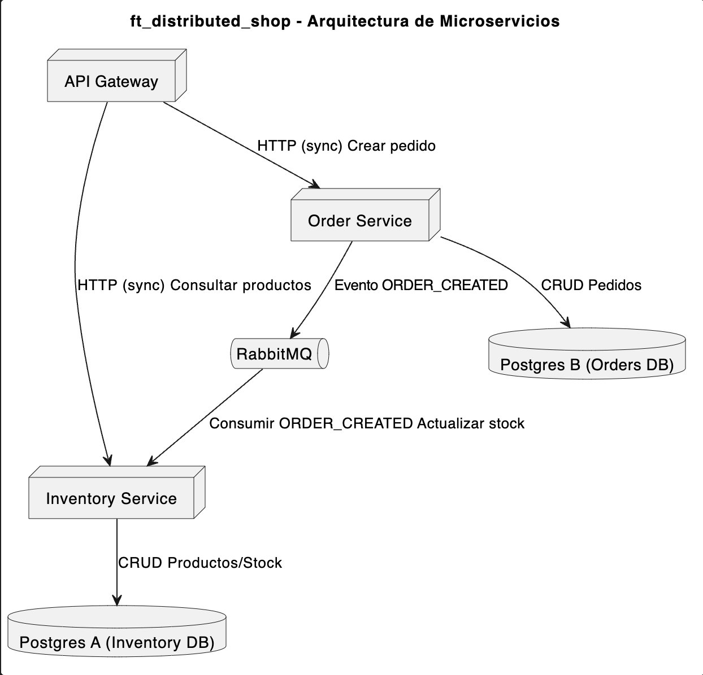

# 🟣 distributed_shop — Micro-Ecommerce Distribuido

> _"Divide y vencerás: Arquitectura de Microservicios"_

Este proyecto implementa un **sistema distribuido de e-commerce**, inspirado en arquitecturas reales de backend modernas.  
En lugar de una API monolítica, el sistema se divide en **microservicios independientes** que se comunican entre sí mediante HTTP y **RabbitMQ**.

Incluye:

- API Gateway (punto único de entrada)
- Servicio de Inventario
- Servicio de Pedidos
- RabbitMQ como Message Broker
- 2 bases de datos PostgreSQL (una por servicio de dominio)
- Orquestación completa con **Docker Compose**

---

## 📄 Documentación

- **Subject del proyecto:** [`docs/subject.md`](docs/subject.md)  
- **Planificación por sprints:** [`docs/planificacion.md`](docs/planificacion.md)

---

## 🧱 Arquitectura General



Principios clave:

- **Database per Service**: cada microservicio tiene su propia base de datos.
- **Event-Driven Architecture**: los servicios se comunican por eventos (ORDER_CREATED, etc.).
- **Consistencia eventual**: el stock se descuenta de forma asíncrona.

---

## 🛠️ Tech Stack

- Lenguaje: TypeScript
- Framework: NestJS
- Base de Datos: PostgreSQL
- Contenedores: Docker & Docker Compose
- Mensajería: RabbitMQ
- ORM: Prisma
- Docs API: Swagger (@nestjs/swagger)

---

## 🔧 Requisitos Previos

Antes de ejecutar el proyecto, asegúrate de tener instalado:

- **Node.js 22+**
- **npm** o **pnpm** (recomendado)
- **Docker Desktop** (imprescindible)
- **Git** (para clonar el repositorio)
- (Opcional) **Postman / Thunder Client** para probar los endpoints
- (Opcional) **NestJS CLI** para mayor comodidad:  

```bash
npm install -g @nestjs/cli
```

---

## 📂 Estructura del Proyecto 

```text
distributed_shop/
│
├── api-gateway/          # NestJS - Gateway + Auth + orquestación
├── inventory-service/    # NestJS - Productos y stock
├── order-service/        # NestJS - Pedidos
│
├── docker-compose.yml
├── README.md
└── docs/
    ├── subject.md
    └── planificacion.md
```

## 🚀 Cómo ejecutar el proyecto

```bash
git clone https://github.com/Kevgonz93/distributed_shop.git
cd distributed_shop
docker-compose up --build
```

Servicios esperados:

- **API Gateway** → http://localhost:3000
- **Inventory Service** → http://localhost:3001 (interno, normalmente)
- **Order Service** → http://localhost:3002 (interno, normalmente)
- **RabbitMQ Management UI** → http://localhost:15672
  - Usuario: guest
  - Password: guest

---

## 🧪 Endpoints

> Nota: Estos endpoints pertenecen al API Gateway y representan el flujo base del sistema. Cada microservicio expone sus propias rutas internas no accesibles desde el exterior.

### Auth / Usuarios (API Gateway)

- POST /auth/register – Registrar usuario
- POST /auth/login – Login, devuelve JWT

### Productos (a través del Gateway)

- GET /products – Listar productos
- GET /products/:id – Ver detalle de un producto
- POST /products – Crear producto (admin)
- PATCH /products/:id – Actualizar producto
- DELETE /products/:id – Eliminar producto

### Pedidos

- POST /orders – Crear pedido
- GET /orders – Listar pedidos del usuario
- GET /orders/:id – Ver detalle de un pedido

---

## 🏃 Plan por Sprints

| Sprint | Enfoque 								| Resumen									 |
|--------|--------------------------------------|--------------------------------------------|
|   0    | Docker + “Hola Mundo” 				| Contenedores comunicándose entre sí 		 |
|   1    | Lógica de negocio aislada (CRUD) 	| CRUD de productos y pedidos + DB separadas |
|   2    | Comunicación HTTP 					| Gateway ↔ Inventory vía REST 				 |
|   3    | RabbitMQ y eventos 					| ORDER_CREATED + consumo en Inventory 		 |
|   4    | Documentación y preparación final 	| Swagger, README y diagrama de arquitectura |

---

## 🎯 Objetivos de Aprendizaje

- Diferenciar Monolito vs Microservicios.
- Entender Database per Service y acoplamiento débil.
- Aplicar Event-Driven Architecture con RabbitMQ.
- Gestionar resiliencia: si el Inventario está caído, los mensajes se quedan en cola hasta que vuelva a levantar.
- Preparar un proyecto portfolio-ready para mostrar en entrevistas.

---

## 🧩 Trabajo Futuro / Ideas de Mejora

- Añadir sistema de roles (admin/user).
- Implementar saga pattern o mecanismos de compensación ante fallos.
- Métricas y observabilidad (Prometheus, Grafana, logs estructurados).
- Integrar un pequeño frontend (Next.js, React, etc.) consumiendo el Gateway.

---

## 📜 Licencia

Proyecto educativo.
Úsalo libremente para aprender, practicar y mejorarlo.
